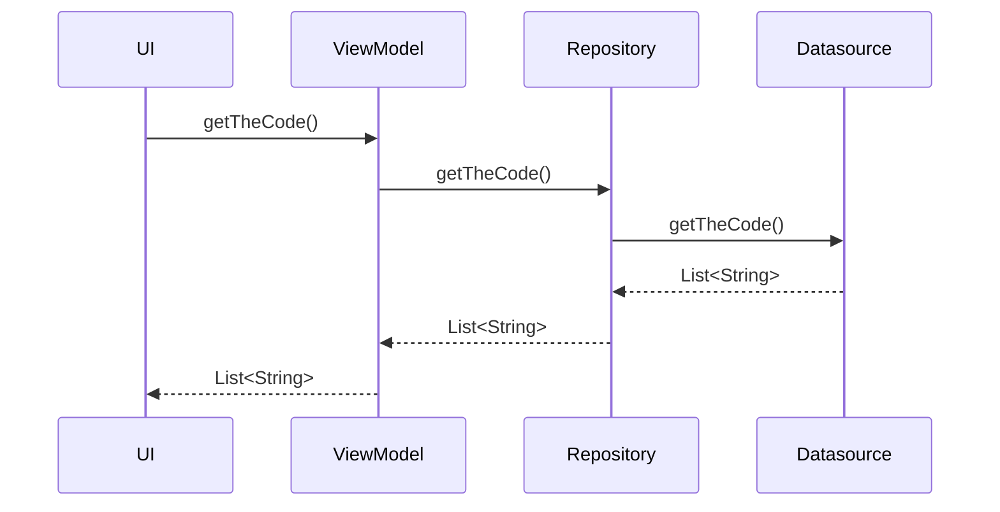

### Entry method: getTheCode() in class UI.

```mermaid
sequenceDiagram
    UI ->> ViewModel: getTheCode()
    ViewModel ->> Repository: getTheCode()
    Repository ->> Datasource: getTheCode()
    Datasource -->> Repository: List<String>
    Repository -->> ViewModel: List<String>
    ViewModel -->> UI: List<String>
```
